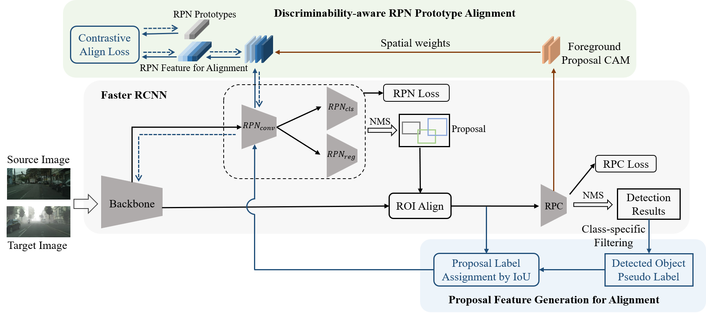

# RPN Prototype Alignment For Domain Adaptive Object Detector 

## Framework



## Example Results


## Introduction

In this project, we use Pytorch 1.7.0 and CUDA version is 10.1. 

## Datasets

### Datasets Preparation

* **Cityscape and FoggyCityscape:** Download the [Cityscape](https://www.cityscapes-dataset.com/) dataset, see dataset preparation code in [DA-Faster RCNN](https://github.com/yuhuayc/da-faster-rcnn/tree/master/prepare_data).
* **Sim10k:** Download the dataset from this [website](https://fcav.engin.umich.edu/sim-dataset/).  

## Models

### Pre-trained Models

In our experiments, we used two pre-trained models on ImageNet, i.e., VGG16 and ResNet101. Please download these two models from:
* **VGG16:** [Dropbox](https://www.dropbox.com/s/s3brpk0bdq60nyb/vgg16_caffe.pth?dl=0)  [VT Server](https://filebox.ece.vt.edu/~jw2yang/faster-rcnn/pretrained-base-models/vgg16_caffe.pth)
* **ResNet101:** [Dropbox](https://www.dropbox.com/s/iev3tkbz5wyyuz9/resnet101_caffe.pth?dl=0)  [VT Server](https://filebox.ece.vt.edu/~jw2yang/faster-rcnn/pretrained-base-models/resnet101_caffe.pth)


## Train

```
CUDA_VISIBLE_DEVICES=$GPU_ID bash ./experiments/scripts/rpn_train.sh train ./configs/rpa/normal_to_foggy.xml
```


## Test

```
CUDA_VISIBLE_DEVICES=$GPU_ID bash ./experiments/scripts/rpn_train.sh test ./configs/rpa/normal_to_foggy_test.xml
```

